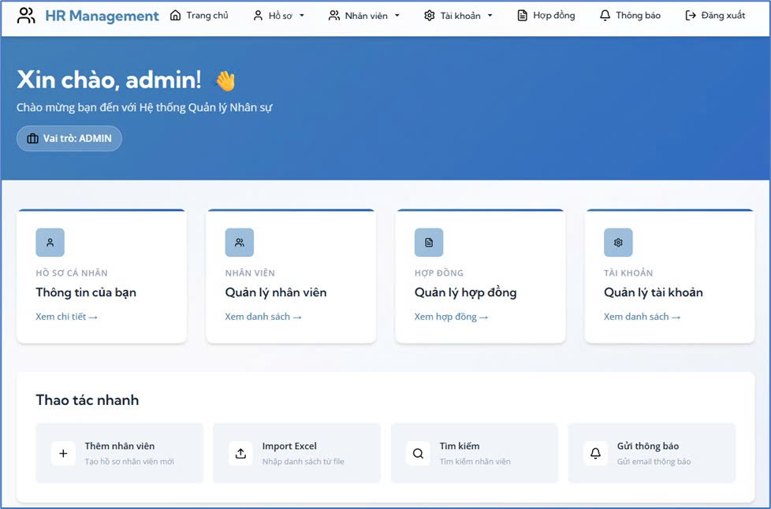
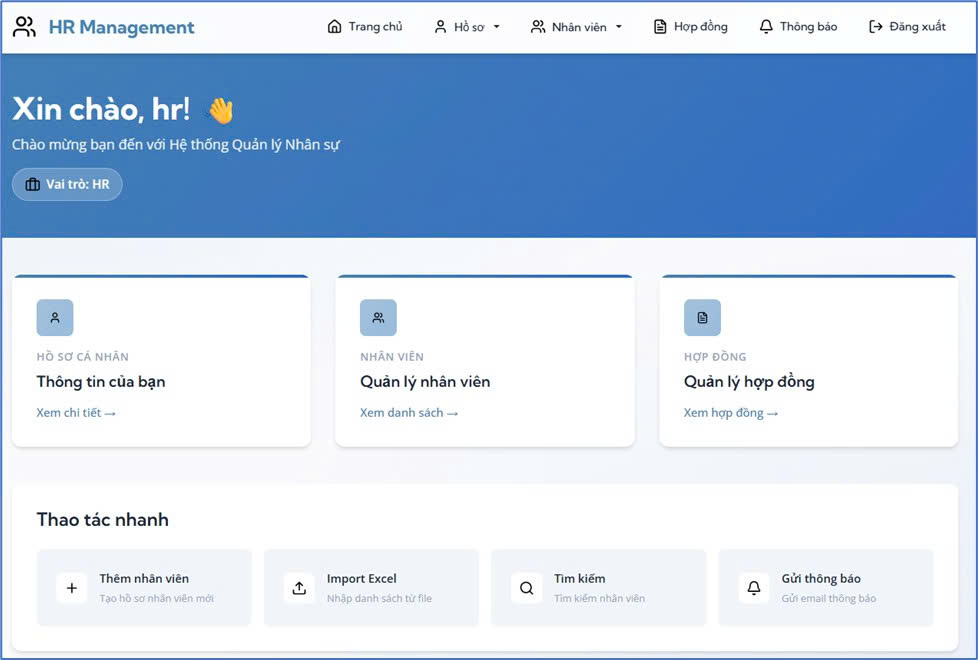
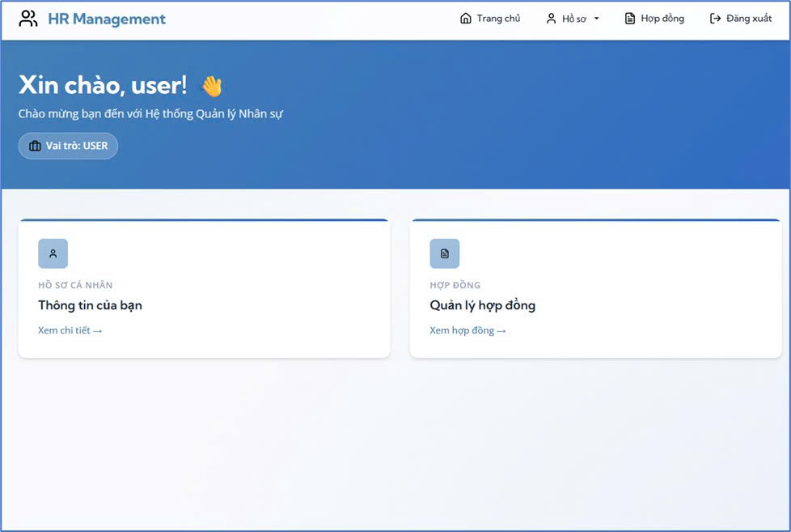

# OWASP Website

## Introduction
This project is a Human Resources (HR) management web application developed based on OWASP Top 10 2021 security practices.  
The system is designed to manage employee information and HR-related workflows while focusing on implementing secure web application practices.

The application demonstrates how common web vulnerabilities can be mitigated using secure coding techniques such as authentication control, input validation, and role-based access control.  
It is intended for learning, research, and security practice related to web application security.

Project repositories:

Website OWASP:  
[https://github.com/xianfuhui/owasp-website](https://github.com/xianfuhui/owasp-website/tree/main/Safe%20Source)

Website OWASP SAFE:  
[https://github.com/xianfuhui/owasp-safe-website](https://github.com/xianfuhui/owasp-website/tree/main/Unsafe%20Source)

---

## Technologies Used

**Backend**
- Spring Boot

**Frontend**
- Thymeleaf
- JavaScript
- HTML
- CSS

**Database**
- MongoDB

---

## Features
| HR Web Function | OWASP Vulnerability | Example Attack / Scenario | Mitigation |
|-----------------|--------------------|---------------------------|------------|
| Login / Logout | A07 – Authentication Failures | An attacker attempts to guess passwords or perform brute-force attacks because the system does not lock accounts after multiple failed login attempts. | Use bcrypt password hashing, limit login attempts, enable two-factor authentication (2FA), and properly manage session expiration. |
| Employee Profile Management | A01 – Broken Access Control | A user modifies the `employee_id` parameter in the URL to access another employee’s profile information. | Enforce server-side authorization checks and implement role-based access control (RBAC). |
| Employee Search | A03 – Injection | The `searchVulnerable` function concatenates JSON query strings directly. An attacker can inject payloads (e.g., `$or`, regex `.*`) to retrieve all records. | Use prepared statements or ORM frameworks and validate/sanitize user input. |
| Contract File Viewing / Download | A02 – Cryptographic Failures | PDF files containing salary information are transferred over HTTP without encryption. | Enforce HTTPS, apply file access control, and restrict public sharing. |
| Employee Information Update | A04 – Insecure Design | The frontend form allows modification of roles or privileges directly by users. | Implement security logic on the backend and restrict role modification to administrators only. |
| Admin Panel | A05 – Security Misconfiguration | Debug mode is enabled and the `/admin` endpoint is accessible to all users. | Disable debug mode in production, hide admin routes, and restrict access using role-based permissions. |
| Avatar Upload via URL | A10 – Server-Side Request Forgery (SSRF) | An attacker provides a URL such as `http://127.0.0.1:8080/internal/config`, causing the server to access internal resources. | Allow only trusted domains, block internal IP ranges (RFC1918), and disable automatic redirects. |
| Contract / Avatar Import | A08 – Software and Data Integrity Failures | The system automatically imports files that may contain malicious macros or scripts. | Restrict file formats to safe types (e.g., sanitized PDF) and validate uploaded files. |
| Activity Logging | A09 – Security Logging and Monitoring Failures | Lack of proper logging prevents detection of suspicious login attempts or abnormal activities. | Implement detailed logging and monitoring, and alert administrators about unusual behavior. |
| Internal Notifications / Email System | A06 – Vulnerable and Outdated Components | The application uses outdated libraries that contain known security vulnerabilities. | Regularly update dependencies and use dependency vulnerability scanners. |

---

## Screenshots

### Admin Page


### HR Page


### User Page


---

## Setup

Run Spring Boot

Upload the following data files into MongoDB:

- `hr.accounts.json` → collection: **accounts**
- `hr.employees.json` → collection: **employees**

Example using **mongoimport**:

```bash
mongoimport --jsonArray --db hrdb --collection accounts --file hr.accounts.json
mongoimport --jsonArray --db hrdb --collection employees --file hr.employees.json
